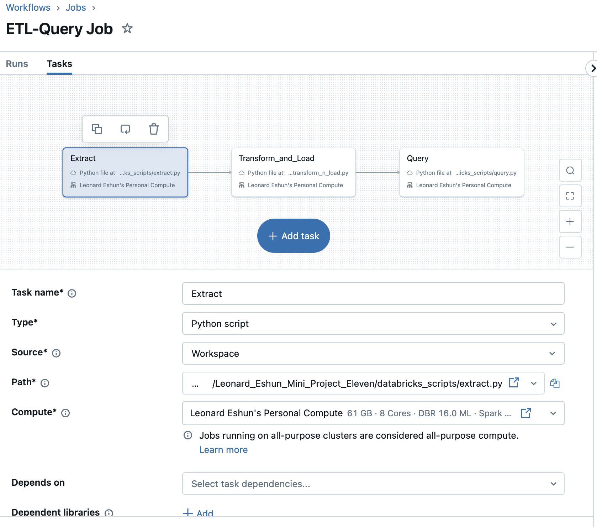
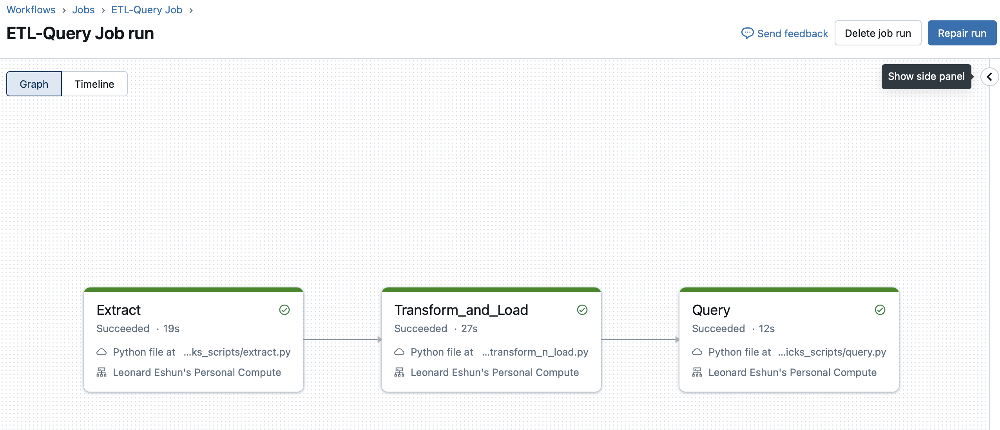
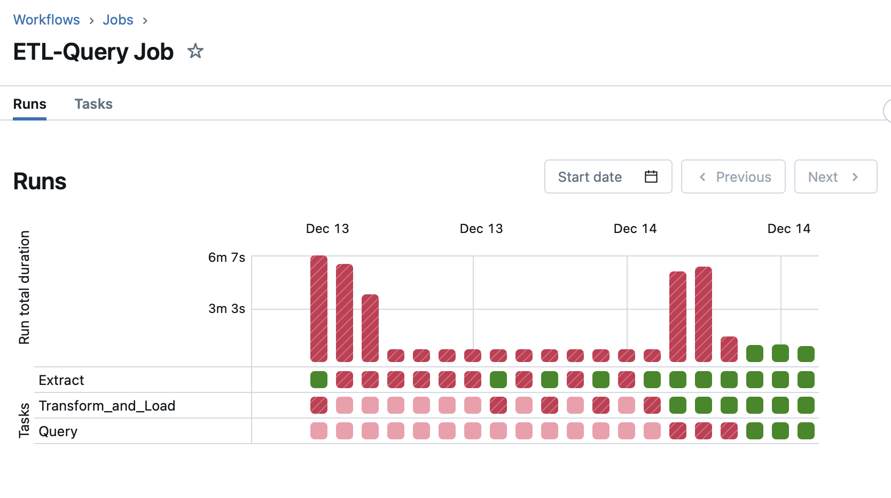

# Data Engineering Mini Project Eleven

[](https://github.com/nogibjj/Leonard_Eshun_Mini_Project_Eleven/actions/workflows/workflow.yml)


This repository is created as an assignment from the Data Engineering course, IDS 706. The aim is to create a a data pipeline using Databricks.

The requirements are:

1. Create a data pipeline using Databricks
1. Include at least one data source and one data sink
1. .devcontainer  to ensure consistency, portability, and isolation for projects' development environment.
1. Makefile (with commands for setup, testing, and linting)
1. Have a functioning CI/CD for setup, lint, test (with a badge on the readme)
1. README.md with setup and usage instructions


## Databricks
Three tasks were created to do data extraction, transformation and loading, and query


The run sequentially from left to right and any failure stops subsequent tasks from running.


After a number of executions and debugging, they all executed successfully.



## The functions and what they do

1. **extract** to read and extract an external csv file via its url and save to file in the /data folder using the name you give it. 
	```python
	extract(url: str, file_name: str,) -> str
	```
	The parameters are:
	- url : The url for the external CSV file
	- file_name : The file name to use to save the CSV file locally

	>**Note:**
	>Give the CSV file a header (first row).


1. **transform_n_load** to create a number of tables in PySpark based on the table structures you give it for transformation, then make them available for processing. 
	```python
	transform_n_load(    
		local_dataset: str,
    	new_data_tables: dict,
    	new_lookup_tables: dict,
    	column_map: dict,)
	```
	The parameters are:
	- local_dataset : The local CSV file to load
	- new_data_tables : A dictionary of the tables non-lookup tables to be created. The key is the table name and the value is another dictionary of the column attributes, eg. Integer, Primary Key. The key is the column name and the values are the attributes.   
	- new_lookup_tables : A dictionary of the tables lookup tables to be created. The key is the table name and the value is another dictionary of the column attributes, eg. Integer, Primary Key. The key is the column name and the values are the attributes.   
	- column_map : A dictionary maping the columns in the new tables defined above to the column indices in the CSV file. The key is the column.

	>**Note:**
	>The ID Primary Key of the table should always be the first column. 
	>Column names also shouldn't have spaces.


1. **read_data** to read one data from a PySpark dataframe based on the record id you give it.
	```python
	read_data(table_name: str, data_id: int)
	```
	The parameters are:
	- table_name : The name of the PySpark Dataframe.	
	- data_id : The ID of the record to be read.	

1. **read_all_data** to read all the records from a PySpark dataframe.
	```python
	read_all_data(table_name: str)
	```
	The parameters are:
	- table_name : The name of the PySpark dataframe.	


1. **save_data** to save records to a dataframe you give it, following the table column structure. PySpark Dataframes are immutable so we can't change them directly. What I do is create another dataframe from the incoming record and append it to the existing dataframe using union.
	```python
	save_data(table_name: str, row: list)
	```
	The parameters are:
	- table_name : The name of the PySpark dataframe.
	- row : A list of the row tuples to be saved. The order should follow the exact output of the ```get_table_columns``` function for that table.

1. **delete_data** to delete a record from the database given a record ID. PySpark Dataframes are immutable so we can't change them directly. What I do is to filter out the record to be deleted and create a new dataframe from the result.
	```python
	delete_data(table_name: str, data_id: int)
	```
	The parameters are:
	- table_name : The name of the PySpark dataframe.	
	- data_id : The ID of the record to be 'deleted'.	


1. **get_table_columns** to get the column names of a table. This is useful for saving a new record.
	```python
	get_table_columns(table_name: str)
	```
	The parameters are:
	- table_name : The name of the  PySpark dataframe.


## Main Function
The main.py script provides executes an aggregation sql statement to get the average air quality information for different indicators and time periods.
1. It displays the output of the query in the console.
1. Saves the raw output of the dataframe result in folder (Aggregation_Query_Result).
1. Saves the tabular result as displayed to an md file (Query_Output.md).


## Log of successful operations
The test operation saved its steps to a log file to show the success of the operations.

[Please find the file here](Test_Log.md)